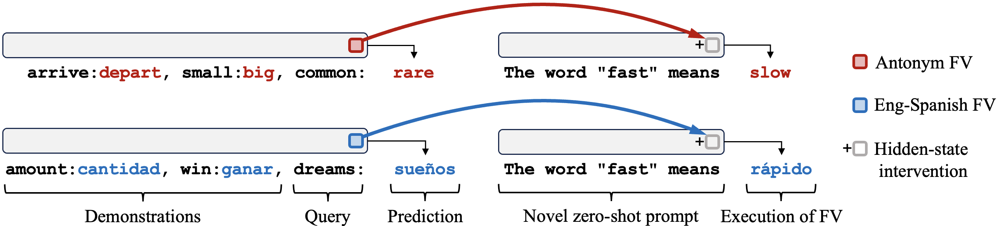
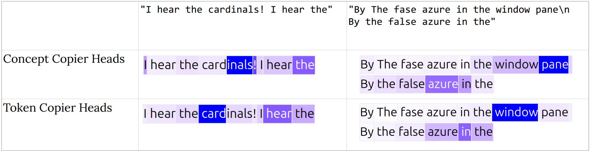
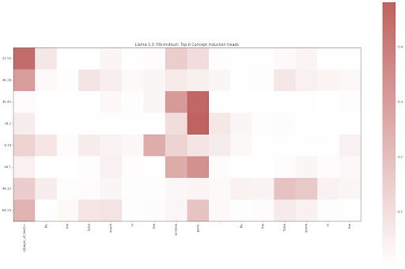

# LLMs Process Lists with General Filter Heads --- Additional Experiments

## Experiment 1: Role of Individual Filter Heads

It is challenging to attribute specific roles to individual filter heads because they often work in combination to achieve the desired functionality. Also, neural nets like LMs implement algorithms in a distributed manner with multiple backup components. These redudant pathways can actively resist the intervention on a single head.

Maybe we can check what do individual heads directly add to the residual stream to better isolate their roles. Here we report our results.

### Decoding the Contribution of Individual Filter Heads
A naive approach to interpret latents is to directly apply the LM decoder head on them to check what are the top predicted tokens. This technique is popularly known as "Logit Lens" (see [nostalgebraist, 2020](https://www.lesswrong.com/posts/AcKRB8wDpdaN6v6ru/interpreting-gpt-the-logit-lens))

Since attention heads add to the residual stream they have the same dimensionality as the residual stream, making it possible to apply the logit lens directly on the output of individual heads. Maybe we can check what tokens are being promoted most by a specific head.

We use SelectOne prompts for this analysis. See below for an example

```
Options: Grape, Marker, Scarf, Stadium, Monkey, Bed.
Which among these objects mentioned above is a fruit?
Answer:
>>> " Grape"
```

Below we show 5 examples for one filter head L35, H19 from Llama-3.3-70B-Instruct. Interestingly, we sometimes see the letter the filtered item starts with in the top tokens promoted by this filter head. But this observation is not consistent across all examples for this head. Also not all filter heads show this behavior. So it is unclear for us if this is a meaningful pattern.

```
Format: (Expected Filtered Item, First token) -> Top Tokens in LogitLens

('Banana', ' Banana') -> ['_B', 'engin', ' bindActionCreators', 'utenberg', 'avia', 'atsapp', ' bana', 'dojo', ' titular', '袋']

('Hickory', ' Hick') -> [' H', 'Premium', 'coma', 'ITER', '.habbo', '.hwp', 'anke', '｡', '우', ' hrad']

('Mall', ' Mall') -> [' М', ' M', '_M', '-M', '.m', '.M', ' Μ', '_m', '\xa0M', ' Fallon']

('Zebra', ' Z') -> [' V', 'olo', 'w', ' crypt', ' Vegan', 'rott', '469', 'ýt', ' animal', 'apon']

('Notebook', ' Notebook') -> ['_N', ' consect', ' N', 'roman', 'dea', ' ', '\xa0N', '息', 'ILER', 'aste']

('Sweater', ' Swe') -> ['_S', '\xa0S', ' シ', 'apon', '.sponge', 'ROWSER', '�', '\tS', ' Emblem', '469']


```

For the same set of examples, we also subtract the logit lens output of the residual stream before the head from the logit lens output of the head contribution. This gives us the tokens that are specifically being promoted by the head and not carrying signals from the previous layers. Mathematically,

$$
\begin{align}
\mathrm{logit\_diff} &= \mathrm{Decoder}\big(\text{OV contribution of head $[\ell, j]$}\big) - \mathrm{Decoder}\big(h^{\ell-1}\big) \nonumber \\
\text{Where,} & \;\; h^{\ell-1} \text{ is the output of the previous layer} \nonumber \\
\text{and, } & \;\; \mathrm{Decoder}(x) = \mathrm{LM\_head}\Big(\mathrm{final\_norm}\big(x\big)\Big) \nonumber 
\end{align}
$$


```
Format: (Expected Filtered Item, First token) -> Top Tokens in LogitLens Difference

('Banana', ' Banana') -> [' -*-\r\n', '��', '�부', ':.:.:', ' titular', '�数', '��', 'časí', 'EMPLARY', ' bindActionCreators']

('Hickory', ' Hick') -> [' -*-\r\n', '_Tis', ' withString', '.IsAny', 'blr', ' Hizmetleri', 'hani', ' kabil', ' �', '-prepend']

('Mall', ' Mall') -> [' -*-\r\n', '�a', ' RegexOptions', 'itmap', 'GNUC', '.Formatter', ' withString', 'LEGRO', 'oldur', 'Ｍ']

('Zebra', ' Z') -> [' -*-\r\n', '��', 'ýt', '̧', 'icari', 'ako', '�数', ' vign', 'ertz', '札']

('Notebook', ' Notebook') -> [' -*-\r\n', 'ertino', '��', 'roman', 'GNUC', '圍', 'ertest', ' Ler', 'čer', '围']

('Sweater', ' Swe') -> [' -*-\r\n', '��', ' setContentView', ' bestselling', '�', '�数', 'ähr', ' ساله', ' withString', '�']


```

We also utilize PatchScope from [Ghandeharioun, 2024](https://arxiv.org/abs/2401.06102), which does not show any interpretable patterns. We patch the OV contribution of the head at layer 5. Please refer to our code in `notebooks/302/OV_contribution.ipynb` for details.

```

Format: (Expected Filtered Item, First token) -> Top Tokens in PatchScope

('Banana', ' Banana') -> [' ', ' fifty', ' Fifty', ' \n', ' error', ' sixty', ' Error', ' number', ' -', ' not']

('Hickory', ' Hick') -> [' ', ' fifty', ' sixty', ' \n', ' Fifty', ' error', ' not', ' -', ' Error', ' number']

('Mall', ' Mall') -> [' ', ' fifty', ' seventy', ' Fifty', '57', ' \n', ' sixty', ' Sevent', ' number', ' not']

('Zebra', ' Z') -> [' ', '02', '32', '52', '50', '0', ' -', '56', '58', ' \n']

('Notebook', ' Notebook') -> [' ', '50', ' fifty', '30', ' \n', ' Fifty', ' number', ' -', '60', ' sixty']

('Sweater', ' Swe') -> [' ', ' \n', ' fifty', ' error', ' not', '50', ' sixty', ' -', ' :', '60']

```


### Checking if SAE's can find Interpretable Features in the Contribution of Individual Filter Heads

We utilize [Goodfire’s SAE for layer 50](https://huggingface.co/Goodfire/Llama-3.3-70B-Instruct-SAE-l50) and access the labels of the features via their companion library [goodfire](https://github.com/goodfire-ai/goodfire-sdk). For an individual filter head, we take its OV contribution for a filter task prompt and get the k-nearest features from the SAE feature space. Then we check the labels of these features to see if they correspond to any interpretable concepts.

We don't really see any interpretable patterns with this approach. We acknowledge that this approach might not be appropriate since the SAE is trained on the residual stream activations. Also layer 50 is quite far from the location of our filter head (layer 35). But here we include results for one example for completeness.

```
Prompt: 
"""
Options: Locket, Bangle, Library, Blueberry, Submarine, Trombone.
Which among these objects mentioned above is a fruit?
Answer:
"""

------------------------------------------------------------------------------------------------

Format: SAE Index (Activation) -> Feature Label

25085 (0.656): Feature("Structural delimiters and date formatting in system metadata")
27078 (0.252): Feature("The assistant is in the middle portion of generating a numbered list")
12673 (0.391): Feature("Assistant providing detailed explanations with structured discourse markers")
60827 (0.322): Feature("List item separators in comma-separated sequences")
2246  (0.355): Feature("Syntactical connectors in structured text generation")
5569  (0.307): Feature("The assistant is providing a structured list or enumeration")
17251 (0.389): Feature("Possessive determiners and equality operators in explanatory contexts")
21864 (0.248): Feature("Patterns of explicit content and offensive descriptions")
61521 (0.332): Feature("Measurement and evaluation phrases across different languages")
35254 (0.271): Feature("Text expressing technical limitations or qualifications")

```


## Experiment 2: Checking if the identifed Function Vector and Concept Heads work as expected.

We use the recipe from the corresponding papers to identify the Function Vector ([Todd et al, 2024](https://functions.baulab.info/)) and Concept Heads ([Feucht et al, 2025](https://dualroute.baulab.info/)). We run their code with minimal modifications to adapt to Llama-3.3-70B-Instruct loaded on multiple GPUs. To identify Induction heads we use the code from Feucht et al, 2024.

In this section, we replicate some sanity check experiments from these papers to verify that we have properly identified these heads in our model. Please refer to Section 3.3 in the main text and Appendix K for details on how these heads relate in the scope of our work.

### Function Vector Heads

<p align="center">

</p> 

We replicate a causal experiment from [Todd et al, 2024](https://functions.baulab.info/). The figure above (Figure 1 from Todd et al, 2024) illustrates the idea. The function vector for a task/function is cached as the sum of the outputs of a set of attention heads (the function vector heads) when the model is performing the task correctly in-context. When we add this function vector to the residual stream at another context to see if it enforces the execution of the same function on this new context. 

<!-- ##### Finding the Function Vector Heads

We computed the function vector heads following Todd et al. (2024). For each attention head in the model, we extracted mean activations from correct in-context learning (ICL) prompts. We computed the average activation for each attention head across all prompts where the model successfully performs the task. We then create corrupt prompts by shuffling the ICL examples to create prompts where inputs are paired with random outputs. While running the model on these corrupted prompts, we replace each attention head's activation with the mean activation from correct prompts. We then calculate how much this intervention increases the probability of the correct answer. We then compute the average indirect effect for each head by averaging the causal indirect effect across all tasks in the dataset, as well as all corrupted prompts for each task. We then select the top 79 heads with the highest average indirect effect head scores. We chose the 79 because this corresponded to the number of filter heads found via our DCM method. These are the top 79 heads that most consistently help recover correct task performance when their activations are patched in. The corresponding function vector is then the sum of the mean outputs from these top causal heads.

##### Validating the Function Vector Heads

We validated the function vector heads by testing them on a set of tasks provided by Todd et al.

Our validation showed that we are able to use our found function vector heads to compute function vectors which successfully enforce the behavior of the in-context learning tasks from which they are extracted.

###### Function Vector Computed with Mean Activations from Capitalize Task and Our Function Vector Heads -->

**Example 1: Capitalize**

```python
# Baseline Clean In-Context Learning
Input Sentence: '<|endoftext|>Q: cow\nA: Cow\n\nQ: him\nA: Him\n\nQ: generous\nA: Generous\n\nQ: wolf\nA: Wolf\n\nQ: lemur\nA: Lemur\n\nQ: jog\nA:' 

Input Query: 'jog', Target: 'Jog'

ICL Prompt Top K Vocab Probs:
 [(' Jog', 0.97461), (' Run', 0.00768), (' jog', 0.00398), (' I', 0.00111), (' JO', 0.00095)] 

# Zero-Shot Test
Input Sentence: '<|endoftext|>Q: jog\nA:' 

Input Query: 'jog', Target: 'Jog'

Zero-Shot Top K Vocab Probs:
 [(' run', 0.61475), (' Jog', 0.05811), (' Run', 0.04184), (' exercise', 0.03085), (' running', 0.02638)] 

Zero-Shot+FV Vocab Top K Vocab Probs:
 [(' Jog', 0.94043), (' jog', 0.04004), (' Run', 0.00419), (' JO', 0.00214), (' J', 0.00128)]

# Natural Language Test
Input Sentence:  'The word "jog" means'
Llama: '<|begin_of_text|>The word "jog" means to run at a slow pace. It is a'
Llama+FV: '<|begin_of_text|>The word "jog" means Jog Jog Jog Jog Jog Jog Jog Jog Jog Jog'
```

<!-- **Example 2:**
```python
# Baseline Clean In-Context Learning
Input Sentence: '<|endoftext|>Q: cow\nA: Cow\n\nQ: him\nA: Him\n\nQ: generous\nA: Generous\n\nQ: wolf\nA: Wolf\n\nQ: lemur\nA: Lemur\n\nQ: lizard\nA:' 

Input Query: 'lizard', Target: 'Lizard'

ICL Prompt Top K Vocab Probs:
 [(' L', 0.99707), (' Re', 0.00083), (' lizard', 0.00069), (' \n\n', 8e-05), (' ', 8e-05)]

# Zero-Shot Test
Input Sentence: '<|endoftext|>Q: lizard\nA:' 

Input Query: 'lizard', Target: 'Lizard'

Zero-Shot Top K Vocab Probs:
 [(' rept', 0.20935), (' scale', 0.15198), (' A', 0.1012), (' Re', 0.09509), (' L', 0.08728)] 

Zero-Shot+FV Vocab Top K Vocab Probs:
 [(' L', 0.93506), (' lizard', 0.02695), (' Re', 0.00875), (' A', 0.00391), (' I', 0.00263)]

# Natural Language Test
Input Sentence:  'The word "lizard" means'
Llama: '<|begin_of_text|>The word "lizard" means "little thief" in Spanish, and the green'
Llama+FV: '<|begin_of_text|>The word "lizard" means Lizard Lizard Lizard Lizard Lizard'
``` -->

<!-- ###### Function Vector Computed with Mean Activations from Present-Past Task and Our Function Vector Heads -->

**Example 2: Present-Past**

```python
# Baseline Clean In-Context Learning
Input Sentence: '<|endoftext|>Q: capture\nA: captured\n\nQ: merge\nA: merged\n\nQ: set\nA: set\n\nQ: jump\nA: jumped\n\nQ: hit\nA: hit\n\nQ: transform\nA:' 

Input Query: 'transform', Target: 'transformed'

ICL Prompt Top K Vocab Probs:
 [(' transformed', 0.99658), (' transform', 0.00239), (' tran', 0.00016), (' transforms', 0.00015), (' (', 0.00011)] 

# Zero-Shot Test
Input Sentence: '<|endoftext|>Q: transform\nA:' 

Input Query: 'transform', Target: 'transformed'

Zero-Shot Top K Vocab Probs:
 [(' Transform', 0.17627), (' The', 0.12402), (' Transformation', 0.06046), (' change', 0.04819), (' Change', 0.03784)] 

Zero-Shot+FV Vocab Top K Vocab Probs:
 [(' transformed', 0.82471), (' transform', 0.03513), (' transformation', 0.01985), (' Transform', 0.01608), (' changed', 0.01038)]

# Natural Language Test
Input Sentence:  'The word "transform" means'
Llama: '<|begin_of_text|>The word "transform" means to change the form or appearance of something. In'
Llama+FV: '<|begin_of_text|>The word "transform" means changed transformed. transformed\ntransformed transformed transformed transformed' 
```

<!-- **Example 2:**

```python
# Baseline Clean In-Context Learning
Input Sentence: '<|endoftext|>Q: capture\nA: captured\n\nQ: merge\nA: merged\n\nQ: set\nA: set\n\nQ: jump\nA: jumped\n\nQ: hit\nA: hit\n\nQ: operate\nA:' 

Input Query: 'operate', Target: 'operated'

ICL Prompt Top K Vocab Probs:
 [(' operated', 0.99316), (' operate', 0.00475), (' operates', 0.00055), (' operating', 0.0004), (' oper', 0.00019)] 

# Zero-Shot Test
Input Sentence: '<|endoftext|>Q: operate\nA:' 

Input Query: 'operate', Target: 'operated'

Zero-Shot Top K Vocab Probs:
 [(' to', 0.14233), (' Oper', 0.10089), (' To', 0.09186), (' An', 0.06168), (' operate', 0.05316)] 

Zero-Shot+FV Vocab Top K Vocab Probs:
 [(' operated', 0.67529), (' operate', 0.14148), (' operating', 0.03809), (' Oper', 0.03662), (' operates', 0.03284)]

# Natural Language Test
Input Sentence:  'The word "operate" means'
Llama: '<|begin_of_text|>The word "operate" means to perform a function or to manage something. In'
Llama+FV: '<|begin_of_text|>The word "operate" means to operated or operated on. operated on operated on' 
``` -->

<!-- ##### Testing the Function Vector Heads on the Filter Tasks

TODO: We tested the function vector heads on the filter tasks by... -->

### Token Copier Heads vs Concept Copier Heads from Feucht et al. (2025)

<p align="center">

</p> 

Feucht et al, 2025 propsed a dual route model of induction in LMs: token-level induction heads which copy individual tokens, and concept-level induction heads which copy entire concepts. Although both types of heads help the model perform induction, looking at their attention patterns reveal a clear difference.

<p align="center">

</p> 

We identify the token copier heads and concept copier heads in Llama-3.3-70B-Instruct using the code from Feucht et al, 2025 with minimal modifications. We then replicate their attention pattern experiment to validate that we have correctly identified the concept heads. Token copier heads attend to the first token of previous occurrences of a word, while concept copier heads attend to the last token of previous occurrences of a multi-token concept. In this figure we are showing the aggregated attention patterns of top-10 token copier heads and top-10 concept copier heads identified in Llama-3.3-70B-Instruct.

<!-- ##### Finding the Concept Heads

We followed Feucht et al. (2025) and computed the concept heads via a causal intervention experiment.
We created special prompts with a repeating structure.
The first half of each prompt included random tokens, plus a multi-token concept (e.g., "waxwing").
The second half of each prompt included the same random tokens repeated, plus the first token of the concept.
We created two versions of each prompt.
The clean prompt has the real concept in the first half.
The corrupted prompt has different random tokens in the first half.
Then, for each attention head in the model, we patched its output from the clean prompt into the corrupted prompt, specifically at the position of the last random token in the second half (the position just before where the concept starts).
We then measured whether this increased the probability of the second token of the multi-token word.
If patching a head increased the probability for the second token of the concept, like "ax" in "waxwing" (which is tokenized as "w", "ax", "wing"), this suggests the head is carrying information about the entire concept, not just individual tokens.
We call this the concept copying score.
Heads with high concept copying scores are concept induction heads.
They are distinct from regular token induction heads, which only increase the probability for the immediate next token.

##### Validating the Concept Heads

Concept induction heads have a characteristic attention pattern wherein they attend to the final token in previous occurrences of a multitoken word which follows previous occurrences of the current word in a context.
The canonical example given in Feucht et al. (2025) uses the context "By the false azure in the windowpane By the false azure in the".
In this case of Llama-2-7b, the model on which they performed their experiment, because "windowpane" is tokenized into three parts ("window", "p" and "ane"), the concept induction heads attend to the "ane" token, as visualized below.


We performed the same experiment, this time on Llama-3.3-70B-Instruct using the concept induction heads we found for Llama-3.3-70B-Instruct.
In this model, the term "windowpane" is divided into two tokens: "window" and "pane".
Below is the attention pattern we see, where the concept heads attend most heavily to the "pane" token.



##### Testing the Concept Heads on the Filter Tasks

TODO: We tested the concept heads on the filter tasks by... -->

